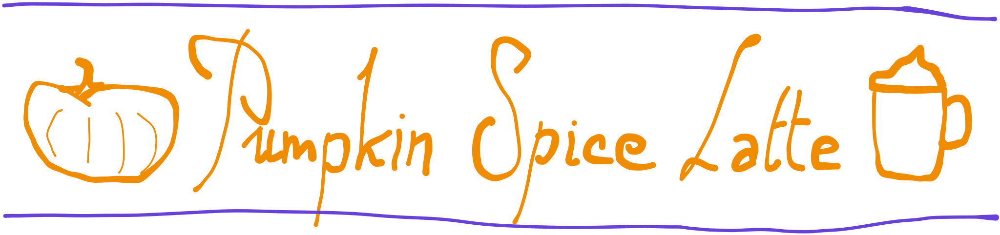
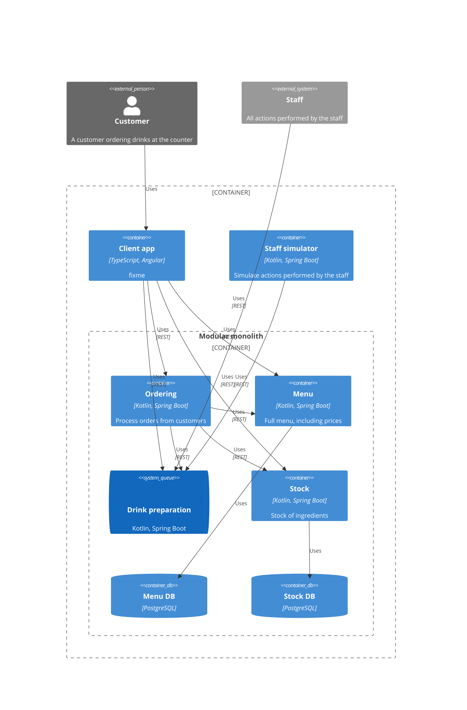
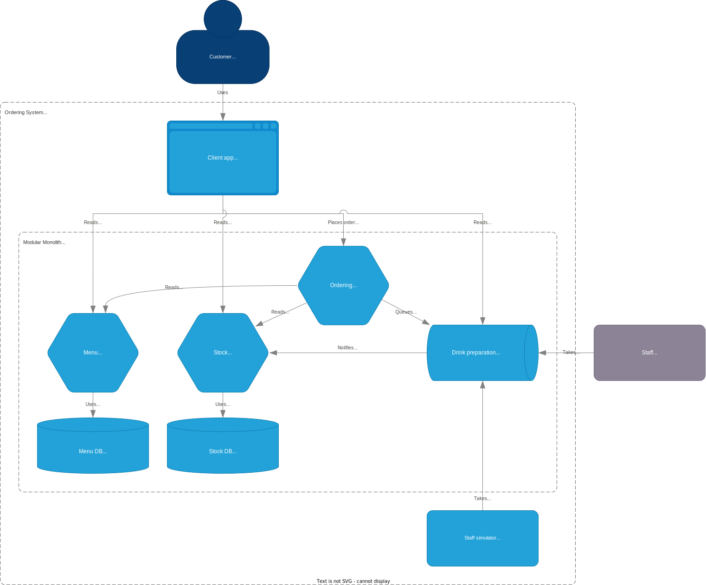

 

This application is used to take orders from customers.

## Check out the [Wiki](https://github.com/sylvaindecout/pumpkin-spice-latte/wiki)

## Architecture

<picture>
  <source media="(prefers-color-scheme: light)" srcset="doc/images/light-c4_container.svg" />
  
</picture>

## Usage

* Run tests for client app: `(cd client-app; npm run test-local)`
* Run tests for back-end: `./gradlew test`
* Run mutation coverage: `./gradlew pitest`
* Start application:
  1. Build packages (backend): `./gradlew build --exclude-task test`
  2. Run on local environment: `docker compose up -d`
  3. Client app can be accessed at http://localhost:4200
  4. Tear down local environment: `docker compose down`

## Guides

* [How to configure local environment](./doc/local_env.md)
* CI/CD
  * How to deploy
  * How to validate deployment
  * How to rollback deployment
* GDPR
  * How to collect personal data
  * How to erase personal data

## Contributing

* [Working practices](https://github.com/sylvaindecout/pumpkin-spice-latte/wiki/Working-practices)
* [Style guide](./doc/style_guide.md)
