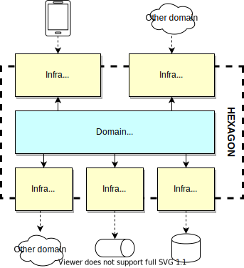

# Isolate domains with Hexagonal Architecture

## Context and Problem Statement

Distinct business domains have been clearly identified.
In order for source code to be easy to understand and to maintain, we want to keep coupling between them under control.

How can we keep business domains properly isolated from one another?

## Decision Outcome

Define *modules*, as defined in [Domain-Driven Design Reference](https://www.domainlanguage.com/wp-content/uploads/2016/05/DDD_Reference_2015-03.pdf), and isolate them from one another following the principles from [hexagonal architecture](https://herbertograca.com/2017/09/14/ports-adapters-architecture), so that they have clearly defined boundaries.

In a nutshell:

* Domain layer never depends on infrastructure layer.
* Domain layer is never depended upon by anything outside the hexagon.
* Infrastructure layer consists in Adapters, which never depend on one another.

The verification of these principles is performed by ArchUnit rules.
A key benefit of these rules is that it makes specific constraints regarding Maven structure unnecessary, and modules can therefore be kept cohesive as one single Maven module.

This is only applicable to modules which include business logic, not technical modules.

### Consequences

* Good, because domain logic is isolated, which makes it easier to test.
* Good, because technology used to implement a specific adapter can shift with considerably little impact on the rest of the application.
* Bad, because this type of architecture comes with some additional complexity in the source code. Mostly, mapping between models exposed with the world and the domain model is usually quite verbose.
  This is considered as acceptable in view of the decoupling it brings in counterpart, especially since we only implement hexagonal architecture for modules which include business logic.
* Bad, because this approach implies some duplication. In particular for exchanged objects and their validation constraints. This can be addressed by the introduction of a shared kernel for the most common concepts.
