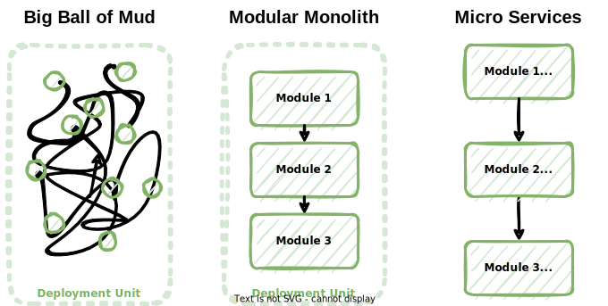

# Structure backend as a modular monolith

## Context and Problem Statement

As stated in [ADR-0001](0001-isolate-domains-with-hexagonal-architecture.md), modules are to be defined matching business domains.

How should the code base be structured in order to keep the modules isolated from one another?

## Considered Options

* Big Ball of Mud - An old school monolith, without modules.
* Modular Monolith - A single code base organised by module. Calls between modules are basic method calls.
* Microservices - Each module is a distinct microservice, which is deployed specifically. Calls between modules go through the network.

## Decision Outcome

The code base is structured as a modular monolith.

### Consequences

* Good, because there is a single deployment unit, which makes deployment simple.
* Good, because challenging the boundaries between modules does not have as much impact as it would in a microservice architecture. This is especially relevant considering that the boundaries are not stable yet.
* Good, because migrating to microservices is easy, as the code base is already modular.
* Good, because modules make the code base easy to navigate.
* Good, because basic method calls between modules are more performant and robust than network calls, for they do not depend on the network.
* Bad, because having one single deployment unit implies that scaling horizontally necessarily applies to all modules, even though some of them may have very different requirements.
  This is considered as acceptable, as moving toward microservices remains an option that could be considered if the need arises.
