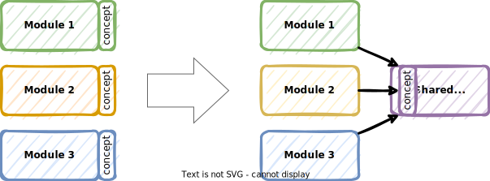

# Share common concepts in a Shared Kernel

## Context and Problem Statement

Some concepts are common to distinct modules.
Should we go for duplication, or introduce dependencies?

## Decision Outcome

Modules share a subset of the domain model, along with directly related code, in what is most commonly known as a **Shared Kernel** (cf. [Domain-Driven Design Reference, by Eric Evans](https://www.domainlanguage.com/wp-content/uploads/2016/05/DDD_Reference_2015-03.pdf)).

### Consequences

* Good, because it aligns the way these common concepts are modelled. This prevents inconsistencies which could result in incompatibilities.
* Good, because this prevents some code duplication. Should fixes on common concepts be needed, they would apply consistently to all dependent modules.
* Bad, because sharing a part of the model makes teams less autonomous. Any change to the Shared Kernel needs to be greenlit by every team. This is considered acceptable, as only *simple* and *stable* concepts are included in the Shared Kernel.
* Bad, because changes required for one module may impact all other modules. This is a sign that concepts are not shared after all, as they include specifics for a given domain. This problem can be dealt with easily by resorting to duplication in such cases.
