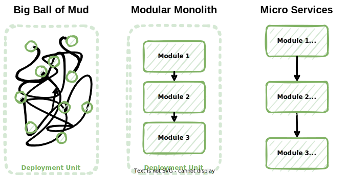

# Structure backend as a modular monolith with network calls

## Context and Problem Statement

As stated in [ADR-0001](0001-isolate-domains-with-hexagonal-architecture.md), modules are to be defined matching business domains.

How should the code base be structured in order to keep the modules isolated from one another, considering that the code base is currently structured as a modular monolith, but some modules have specific requirements for scalability?

## Considered Options

* Big Ball of Mud - An old school monolith, without modules.
* Modular Monolith - A single code base organised by module. Calls between modules are basic method calls.
* Microservices - Each module is a distinct microservice, which is deployed specifically. Calls between modules go through the network.

## Decision Outcome

The code base should migrate from a modular monolith to microservices.
As a first step, it remains a modular monolith, but direct method calls for calls between modules are replaced with network calls.

### Consequences

* Good, because there is a single deployment unit, which makes deployment simple.
* Good, because challenging the boundaries between modules does not have as much impact as it would in a microservice architecture.
* Good, because this is a first step toward migrating to microservices.
* Good, because modules make the code base easy to navigate.
* Good, because it is the occasion to validate that the migration toward microservices will succeed.
  Basically, is the application still usable when relying on the network for calls between modules (are there too many network problems, does the application still match performance requirements, etc.)?
* Bad, because basic method calls between modules would be more performant and robust than network calls, for they do not depend on the network.
  This has been deemed negligible compared to the need to adapt to specific requirements for scalability.
* Bad, because having one single deployment unit implies that scaling horizontally necessarily applies to all modules, even though some of them may have very different requirements.
  This is not considered as acceptable, and a full migration toward microservices is expected to occur in the near future.
